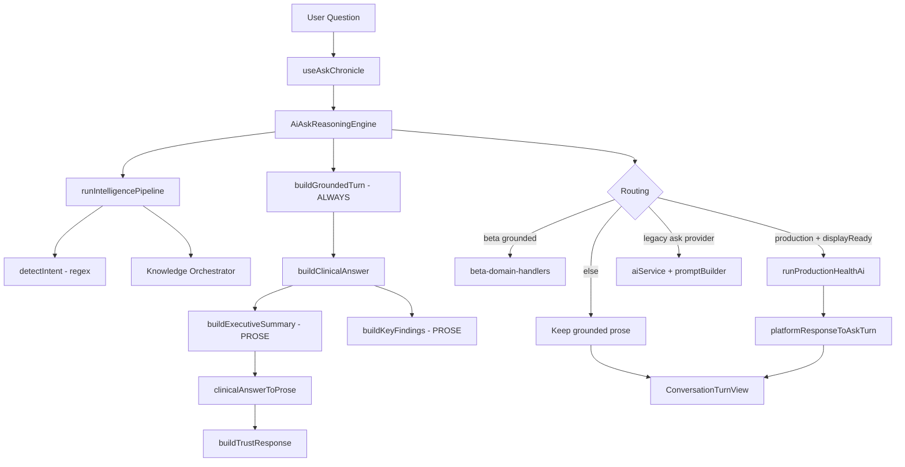
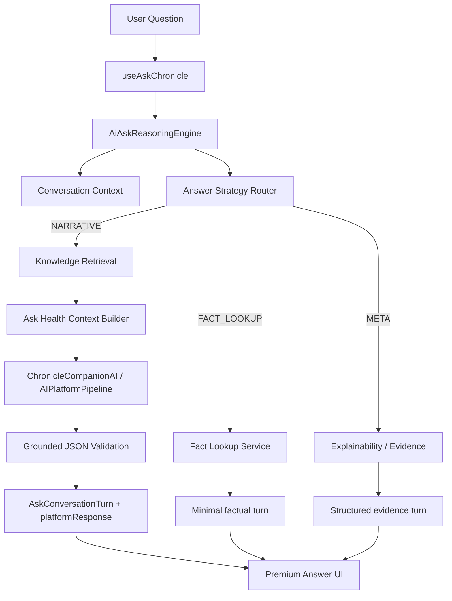

# Ask Chronicle — Architecture Redesign

**Goal:** Premium AI health companion. Chronicle structures facts; Gemini writes every narrative answer.

---

## 1. Current architecture

**Problems:** Deterministic prose is always generated first; Gemini is optional; three LLM stacks; coverage/import language in clinical templates.

---

## 2. Target architecture

**Principle:** Grounding is evidence in context, not an answer strategy.

---

## 3. Answer strategies

| Strategy      | Examples                                               | Writer                       |
| ------------- | ------------------------------------------------------ | ---------------------------- |
| `FACT_LOOKUP` | What is my LDL? Latest HbA1c?                          | Deterministic value + date   |
| `NARRATIVE`   | Explain report, summarize health, compare, doctor prep | Gemini only                  |
| `META`        | Why did you say this? Show evidence                    | Structured evidence (no LLM) |

---

## 4. File-by-file migration

| File                                    | Action                                                                |
| --------------------------------------- | --------------------------------------------------------------------- |
| `routing/answer-strategy.router.ts`     | **New** — strategy resolution                                         |
| `context/ask-health-context.builder.ts` | **New** — structured knowledge only                                   |
| `services/fact-lookup.service.ts`       | **New** — factual answers                                             |
| `services/ai-ask-reasoning.engine.ts`   | **Rewrite** routing order                                             |
| `clinical/clinical-reasoning.engine.ts` | **Remove** prose generators; keep ranking imports via evidence engine |
| `services/grounded-response.builder.ts` | **Refactor** → `buildAskTurnShell` (trust/citations, no prose)        |
| `services/platform-response.adapter.ts` | **Simplify** — no `buildCompanionAnswer` stitching                    |
| `shared/ai/prompt/prompt-templates.ts`  | **Update** physician voice + forbidden topics                         |
| `components/AskPremiumAnswerView.tsx`   | **New** premium sectioned UI                                          |
| `ui/figma/ask/ask-design-tokens.ts`     | **New** color system                                                  |
| `components/TypingIndicator.tsx`        | **Update** streaming UX                                               |
| `ui/figma/screens/FigmaAskScreen.tsx`   | History top-left, empty state                                         |
| `beta/beta-domain-handlers.ts`          | Route narrative to production AI                                      |

---

## 5. Components to remove / simplify

**Remove from user path:** `clinicalAnswerToProse`, `buildExecutiveSummary`, `buildGroundedAnswer`, `AskStructuredResponseView` (legacy), engineering debug routing banner.

**Simplify:** `buildTrustResponse` (no timeline in answer), `follow-up-generator` (prefer Gemini follow-ups).

**Keep:** Intelligence pipeline, health knowledge provider, evidence ranking, session/history drawer, trust evidence items.

---

## 6. Forbidden in user-facing output

OCR, parsing, imports, extraction, coverage, pipeline, workflow, confidence scores, reprocess, registry, Document AI, embedding, vector.
