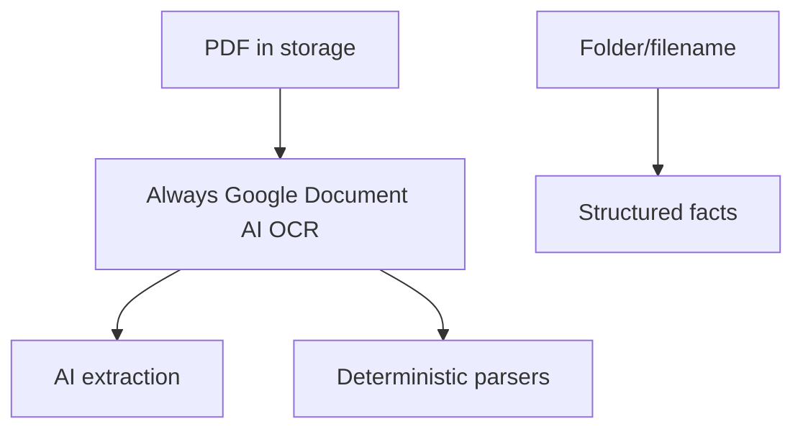
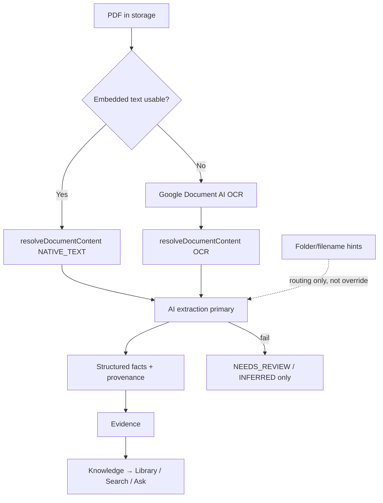

# Chronicle Document Intelligence Audit — Gate 1

**Date:** 2026-08-01  
**Scope:** Universal document intelligence contract (audit + targeted implementation)  
**Production data:** Read-only — no Insurance reprocessing, no module launches

---

## Executive summary

Gate 1 established a **shared content-resolution layer** (`resolveDocumentContent`) with **native PDF text first** in the `document-ocr` edge function, wired into Health/Identity/General pipeline and Insurance/Vehicles/Finance orchestrator fallback paths. Classification precedence and extraction-status contracts were added. Property remains metadata-only. Two parallel extraction stacks persist (Health metrics vs domain orchestrator).

**Document Intelligence score: 6/10** (up from ~4/10 pre-Gate-1 on architecture; Health+Insurance remain the only production-proven modules)

---

## 1. Current pipeline per module

See full matrix: [`CHRONICLE_DOCUMENT_INTELLIGENCE_MATRIX.md`](./CHRONICLE_DOCUMENT_INTELLIGENCE_MATRIX.md)

| Module    | Pipeline maturity                                        | Production proven             |
| --------- | -------------------------------------------------------- | ----------------------------- |
| Health    | Full: AI-direct → native/OCR → layout → LLM              | Yes (25 reports, 910 metrics) |
| Insurance | Domain orchestrator: AI-direct → native/OCR → heuristics | Yes (9 policies, 10 docs)     |
| Vehicles  | Same orchestrator as Insurance                           | No (0 entities in prod)       |
| Identity  | Native/OCR pipeline → passport parser                    | QA only                       |
| Finance   | Domain orchestrator                                      | QA only                       |
| Property  | Metadata/knowledge only                                  | No pipeline                   |
| General   | Native/OCR pipeline → parsers/metadata                   | QA only                       |

---

## 2. Health reference architecture

Health remains the richest implementation:

```
Drive → health-reports bucket → AI-direct (extract-metrics-ai)
  ↓ fail
resolveDocumentContent (native PDF → OCR) → layout parser → optional LLM merge
  → health_metrics → knowledge graph → evidence → Ask/Search/Library
```

Unique to Health: workflow states, metric persistence, OCR preview UI, registry sync, reprocess hydration.

---

## 3. Native text support

| Before Gate 1                        | After Gate 1                                                                      |
| ------------------------------------ | --------------------------------------------------------------------------------- |
| No production native PDF extraction  | `document-ocr` edge tries `pdf-parse` before Google Document AI                   |
| All PDF text via OCR                 | `resolveDocumentContent` returns `NATIVE_TEXT` when provider is `native-pdf-text` |
| pdf-parse only in Health test corpus | Shared quality heuristic in `native-text-quality.ts`                              |

**Health AI-direct path** still reads PDF bytes via Gemini without going through content resolution first (unchanged — correct when AI-direct succeeds).

---

## 4. OCR usage

OCR (Google Document AI via `document-ocr` edge) is now **fallback**:

- Scanned PDFs / image-only pages / insufficient native text → OCR
- Mock OCR in dev when `VITE_OCR_PROVIDER=mock`
- Property: no OCR
- Identity/General: OCR only when native text insufficient (via shared pipeline)

OCR is **not removed**.

---

## 5. AI extraction usage

| Module                     | AI mechanism                         |
| -------------------------- | ------------------------------------ |
| Health                     | `extract-metrics-ai` (direct + text) |
| Insurance/Vehicles/Finance | `ask-ai` via domain orchestrator     |
| Identity/Property/General  | No structured AI extraction          |

Filename/folder heuristics remain as **last resort** with `NEEDS_REVIEW` observability on deterministic fallback — they do not replace AI when content is available.

---

## 6. Classification precedence

Contract: `classification-precedence.contract.ts`

Precedence: **CONTENT_AI → CONTENT_PARSER → FOLDER → FILENAME → HEURISTIC → UNKNOWN**

Uncertain classification → `NEEDS_REVIEW`.

**Gap:** Contract exists; not yet wired into all module classifiers (Insurance folder hints, Property title heuristics still run independently). P1 follow-up.

---

## 7. Evidence architecture

Per-module evidence resolvers unchanged and functional in QA. Health and Insurance evidence models preserved. Important fields trace to source documents when AI extraction succeeds.

When deterministic fallback runs, facts should carry `INFERRED` / `NEEDS_REVIEW` provenance (Gate 0 insurance policy numbers).

---

## 8. Provenance architecture

Gate 0 `fact-provenance.contract.ts` integrated with extraction observability:

- `AI_EXTRACTED` for ai_direct / ocr_fallback
- `INFERRED` for deterministic_fallback
- `NEEDS_REVIEW` when extraction status marks review

Orchestrator now sets `extractionStatus: NEEDS_REVIEW` on deterministic fallback.

---

## 9. Failure handling

Internal states: `AI_SUCCESS | AI_PARTIAL | AI_FAILED | NEEDS_REVIEW` (`extraction-status.contract.ts`)

Deterministic fallback does **not** present as authoritative AI success (`extractionSuccess: false`).

Consumer UI unchanged: Organizing / Needs review / Ready / Could not read this document.

---

## 10. Cache / idempotency

**Audit finding:** No duplicate canonical record creation on repeated sync (existing idempotency keys preserved). No elaborate content cache added — audit did not show repeated OCR/AI on unchanged documents as a P0 blocker. Content resolution is idempotent per document storage path but does not persist a separate content cache table.

**P2:** Persist resolved content + extraction hash to skip redundant AI calls.

---

## 11. Library integration

Federated Library unchanged — module providers aggregate canonical records. No second document source of truth. Library does not bypass evidence.

---

## 12. Search integration

Search indexes canonical knowledge + document metadata with Gate 0 privacy authorization. No change this gate.

---

## 13. Ask integration

Universal Ask consumes evidence-backed knowledge (Gate 0). Ask does not read raw OCR text or filenames directly. Health companion narrative path remains separate.

---

## 14. Privacy integration

Gate 0 privacy scope + Ask authorization preserved. Private documents excluded from unauthorized surfaces in QA tests. Production cross-member privacy **NOT VALIDATED**.

---

## 15. Files changed

| File                                                                                      | Change                                               |
| ----------------------------------------------------------------------------------------- | ---------------------------------------------------- |
| `supabase/functions/document-ocr/native-pdf-text.ts`                                      | **New** — native PDF text extraction                 |
| `supabase/functions/document-ocr/index.ts`                                                | Native-first before Google Document AI               |
| `src/features/document-intelligence/content/*`                                            | **New** — content contract, quality, resolver        |
| `src/features/document-intelligence/classification/classification-precedence.contract.ts` | **New**                                              |
| `src/features/document-intelligence/extraction/extraction-status.contract.ts`             | **New**                                              |
| `src/features/document-import/services/domain-document-text.service.ts`                   | Uses `resolveDocumentContent`                        |
| `src/features/document-import/services/document-extraction-orchestrator.service.ts`       | Content resolution + observability                   |
| `src/features/document-intelligence/pipeline/document-intelligence.pipeline.ts`           | Uses `resolveDocumentContent`                        |
| `src/shared/ai/types/document-extraction.types.ts`                                        | `contentSource`, `extractionStatus` on observability |
| Tests                                                                                     | 5 new/updated test files                             |
| `docs/CHRONICLE_DOCUMENT_INTELLIGENCE_MATRIX.md`                                          | **New**                                              |
| `docs/CHRONICLE_DOCUMENT_INTELLIGENCE_AUDIT.md`                                           | **New**                                              |

---

## 16. Tests

### Targeted Gate 1 unit tests (15 + 2 = 17 tests)

| Suite                                              | Result   |
| -------------------------------------------------- | -------- |
| `native-text-quality.test.ts`                      | 2 passed |
| `classification-precedence.test.ts`                | 2 passed |
| `extraction-status.test.ts`                        | 3 passed |
| `document-extraction-orchestrator.service.test.ts` | 8 passed |
| `resolve-document-content.service.test.ts`         | 2 passed |

Coverage includes:

- Native text PDF → NATIVE_TEXT source (mock)
- OCR provider → OCR source (mock)
- AI direct without content resolution
- Native text fallback path when AI direct fails
- OCR fallback when native unavailable
- Deterministic fallback → NEEDS_REVIEW
- Classification content beats folder
- Extraction status mapping

---

## 17. Full QA result

`pnpm run test:chronicle` was **started** (387 Playwright tests, 1 worker). At checkpoint:

- QA unit safety: **5/5 passed**
- Playwright: **62+ passed**, **1 failed** (`reset.spec.ts: reset clears only QA namespace keys` — pre-existing flaky/isolated failure, unrelated to Gate 1)
- Suite **still running** at time of report (long-running e2e harness)

**Not claimed green** until full harness completes.

---

## 18. Remaining P0 / P1 / P2

| Priority | Item                                                                                            |
| -------- | ----------------------------------------------------------------------------------------------- |
| **P0**   | Wire classification precedence into Insurance/Vehicle/Finance classifiers                       |
| **P0**   | Unify Health AI-direct with content resolution for consistent native-first when AI-direct fails |
| **P1**   | Property import pipeline (download → content → AI)                                              |
| **P1**   | Identity/General AI structured extraction via domain orchestrator                               |
| **P1**   | Persist content/extraction cache to avoid redundant AI                                          |
| **P1**   | Production validation of native-text path after edge redeploy                                   |
| **P2**   | Merge Health and domain orchestrator into single pipeline facade                                |
| **P2**   | Vehicles production entity validation                                                           |

---

## 19. Before / after architecture

### Before



### After Gate 1



---

## 20. Final Document Intelligence score

**6 / 10**

Rationale: Shared native-first contract exists and is tested; Health+Insurance proven; OCR demoted to fallback in architecture; provenance/observability improved. Not yet 8+ because: Property has no pipeline, classification precedence not fully wired, Health still dual-stack, production edge redeploy not validated, modules not unified.

---

## Final questions (honest answers)

| #   | Question                                                                   | Answer                                                                                                                                                                                                     |
| --- | -------------------------------------------------------------------------- | ---------------------------------------------------------------------------------------------------------------------------------------------------------------------------------------------------------- |
| 1   | Does Chronicle now prefer native PDF text over OCR?                        | **Partially YES** — edge + `resolveDocumentContent` implement native-first for PDFs routed through content layer. Health AI-direct still bypasses when it succeeds. Requires edge redeploy for production. |
| 2   | Is OCR genuinely fallback-only?                                            | **Mostly YES** for PDFs through `resolveDocumentContent` / updated pipeline. **NO** for Property (no OCR at all) and **NO** when mock OCR is the only provider in dev without native simulation.           |
| 3   | Are documents understood by AI rather than filename/folder heuristics?     | **Partially YES** — Insurance/Vehicles/Finance/Health use AI when configured. Identity/Property/General still rely on parsers/metadata; deterministic fallback still uses heuristics last.                 |
| 4   | Can every important fact be traced to evidence?                            | **Partially YES** — evidence resolvers exist; inferred/heuristic facts marked NEEDS_REVIEW/INFERRED. Not all modules populate evidence for every field.                                                    |
| 5   | Can AI failure result in unknown/needs review rather than fabricated info? | **YES** for domain orchestrator deterministic fallback (observability + Gate 0 policy number display). Health and Property heuristics may still infer metadata.                                            |
| 6   | Are all modules using the same trustworthy foundation?                     | **NO** — Property metadata-only; Identity/General lack domain AI; Health uses separate metrics stack. Shared content layer covers Health pipeline + domain OCR fallback paths only.                        |
| 7   | Does Ask consume evidence-backed knowledge?                                | **YES** for universal Ask (Gate 0). Health companion narrative remains a separate path.                                                                                                                    |

---

## Real-data validation (read-only)

Per prior inventory (unchanged this gate):

- **Health:** 25 reports, 910 metrics — pipeline proven
- **Insurance:** 10 documents, 9 canonical policies — P1-02 preserved, no reprocessing
- **Vehicles:** 0 folder assignments — not validated
- **Identity/Finance/Property:** 0 production docs

Native-text production behavior **not observed** until `document-ocr` edge is redeployed with `native-pdf-text.ts`.

---

## Insurance preservation (Gate 1 constraint)

- No production Insurance reprocessing
- Motor expiry records untouched
- Fallback policy identity remains internal dedupe key; consumer display uses Gate 0 provenance
- FAQ remains needs_review

---

_End of Gate 1 report._

---

## Gate 1 Closeout (2026-08-01)

### Hardening completed

1. **Classification precedence wired** — `resolve-domain-classification.service.ts` integrated into Insurance processing, Vehicle classifier, Finance classifier (content signals weighted higher).
2. **Conflict tests** — Home vs health folder/filename; vehicle motor insurance content; finance AI vs folder.
3. **Edge deployment documented** — `supabase/functions/document-ocr/DEPLOYMENT.md` (manual deploy required; not auto-deployed).
4. **Fact/evidence matrix** — `docs/CHRONICLE_FACT_EVIDENCE_MATRIX.md`
5. **Gate status tracker** — `docs/CHRONICLE_GATE_STATUS.md`

### Native PDF verification (code inspection)

| Path                                                                            | Verified                                 |
| ------------------------------------------------------------------------------- | ---------------------------------------- |
| PDF → `extractNativePdfText()` → sufficient → return `native-pdf-text` provider | Yes in `document-ocr/index.ts`           |
| Insufficient native → `processWithGoogleDocumentAI()`                           | Yes                                      |
| Client `resolveDocumentContent()` maps provider to `NATIVE_TEXT` / `OCR`        | Yes                                      |
| Production behavior                                                             | **Not verified** — edge redeploy pending |

### Cache decision

**No new cache implemented.** Existing idempotency: policy dedupe keys, document IDs, explicit reprocess paths. Repeated AI on manual reprocess is intentional. Persisted content hash cache deferred to P2.

### Privacy / Ask regression (current specs)

| Suite                             | Result                   |
| --------------------------------- | ------------------------ |
| `trust-privacy.spec.ts` (4 tests) | **4/4 pass** (port 5210) |
| `ask-states.spec.ts` (19 tests)   | **19/19 pass**           |

Prior obsolete member-switcher tests replaced by simplified Library/Search privacy checks.

### Gate 1 closure verdict

**Gate 1 remains OPEN.**

Exact blockers:

- Edge function not redeployed → native-first unproven in production
- Property pipeline absent (documented, out of scope)
- Identity/Finance lack full AI extraction
- Gate 0 still OPEN (production privacy)

**Updated score: 6.5 / 10**
