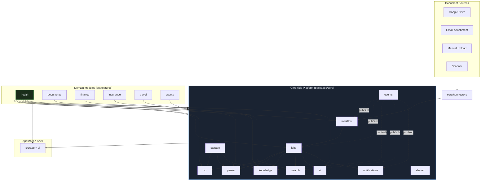
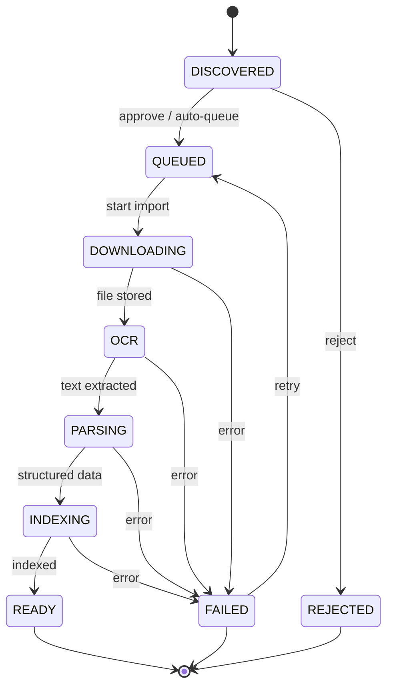
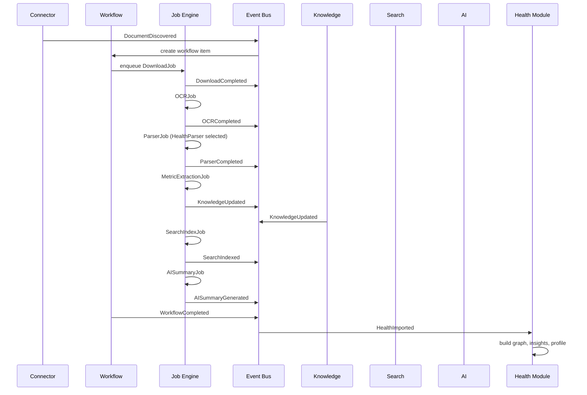

# Chronicle Platform Architecture

**Sprint:** Platform Extraction from Health  
**Status:** Architecture & refactoring plan (no behaviour change in this sprint)  
**Principle:** Health is the first consumer of the Chronicle Platform — not the platform itself.

---

## 1. Architecture Diagram

### Target state



### Document lifecycle (platform workflow)



### Event flow (domain events)



### Current vs target

| Layer           | Today                                     | Target                                     |
| --------------- | ----------------------------------------- | ------------------------------------------ |
| Workflow engine | `src/core/workflow/` ✅                   | `packages/core/workflow/`                  |
| Connectors      | `src/core/connectors/` ✅                 | `packages/core/connectors/` (or shared)    |
| Job engine      | Inline in import/processing services      | `packages/core/jobs/`                      |
| OCR             | `src/features/document-intelligence/ocr/` | `packages/core/ocr/`                       |
| Parser          | Health-only in document-intelligence      | `packages/core/parser/` + domain parsers   |
| Knowledge       | Mixed semantic-memory + health-knowledge  | `packages/core/knowledge/` + domain graphs |
| Search          | `src/features/intelligence/` + `search/`  | `packages/core/search/`                    |
| AI              | `src/features/ai/` + `ask/`               | `packages/core/ai/` + domain prompts       |
| Events          | `workflow-events.ts` only                 | `packages/core/events/`                    |
| Notifications   | Import toasts only                        | `packages/core/notifications/`             |

---

## 2. Folder Structure

### Target monorepo layout

```
chronicle/
├── apps/
│   └── web/                          # Vite shell (router, providers, pages)
│
├── packages/
│   ├── core/
│   │   ├── workflow/                 # State machine, transitions, event types
│   │   ├── jobs/                     # Job queue, retry, progress, cancellation
│   │   ├── connectors/               # Connector framework (Drive, Email, Upload)
│   │   ├── ocr/                      # DocumentOCRProvider + providers + factory
│   │   ├── parser/                     # DocumentParser interface + registry + routing
│   │   ├── knowledge/                # Entity store, relationships, timeline events
│   │   ├── search/                   # Semantic search, ranking, index contracts
│   │   ├── ai/                       # Provider factory, completion, observability
│   │   ├── events/                   # Domain event bus + event types
│   │   ├── notifications/            # Notification channels + subscription
│   │   └── storage/                  # Bucket paths, file hash, upload helpers
│   │
│   └── shared/
│       ├── types/                    # Cross-cutting TypeScript types
│       ├── utils/                    # Date, formatting, tokenization
│       └── config/                   # Env-driven config loaders
│
├── src/
│   └── features/                     # Domain modules (consumers only)
│       ├── health/                   # Health UI, workflow adapter, companion
│       ├── health-import/
│       ├── health-knowledge/
│       ├── health-insights/
│       ├── health-intelligence/
│       ├── health-validation/
│       ├── medical-discovery/
│       ├── documents/                # First non-health consumer (future)
│       ├── finance/
│       ├── insurance/
│       ├── travel/
│       ├── assets/
│       ├── ask/                      # Ask Chronicle UI (uses core/ai)
│       ├── family/
│       └── connectors/               # Connector UI + bootstrap (uses core/connectors)
│
├── supabase/
│   ├── functions/
│   │   ├── document-ocr/             # Generic OCR edge function
│   │   ├── drive-connector/
│   │   └── ask-ai/
│   └── migrations/
│       ├── platform_*.sql            # workflow, connectors, documents, jobs
│       └── health_*.sql              # health_reports, health_workflow_items
│
└── docs/
    ├── CHRONICLE_PLATFORM_ARCHITECTURE.md   # this document
    └── ...
```

### Transitional layout (Phase 0 — current)

Health extraction has already started inside the app:

```
src/core/                    ← platform seeds (workflow, connectors)
src/features/document-intelligence/   ← mixed: OCR generic, parser health
src/features/intelligence/   ← mixed: orchestrator generic, health provider
src/features/knowledge/      ← mixed: contracts generic, health retriever
src/features/semantic-memory/ ← mixed: generic name, health implementation
src/features/health*/        ← health domain
```

Phase 1 moves `src/core/*` → `packages/core/*` without changing import paths (path aliases). Phase 2 splits mixed features.

---

## 3. Package Responsibilities

### `core/workflow`

| Responsibility | Details                                                                          |
| -------------- | -------------------------------------------------------------------------------- |
| State machine  | Generic states: `DISCOVERED → … → READY \| FAILED \| REJECTED`                   |
| Transitions    | Valid transition map, terminal states, review states                             |
| Event types    | `workflow.created`, `workflow.transitioned`, `workflow.ready`, `workflow.failed` |
| Contracts      | `WorkflowItem`, `WorkflowTransitionContext`, `WorkflowProgress`                  |
| **Does NOT**   | Persist to DB, know about health_reports, run side effects                       |

**Today:** `src/core/workflow/workflow.types.ts`, `workflow-events.ts`, `workflow-errors.types.ts`

**Health adapter:** `src/features/health/workflow/health-workflow.service.ts` — maps platform states to `health_workflow_items`.

---

### `core/jobs`

| Responsibility | Details                                                                                                  |
| -------------- | -------------------------------------------------------------------------------------------------------- |
| Job types      | `Download`, `OCR`, `Parser`, `MetricExtraction`, `Embedding`, `AISummary`, `SearchIndex`, `Notification` |
| Queue          | Enqueue, dequeue, priority, concurrency limits                                                           |
| Retry          | Stage-specific retry targets, backoff, max attempts                                                      |
| Progress       | `current/total/percent`, worker id, stage label                                                          |
| Cancellation   | Abort in-flight jobs, mark workflow FAILED                                                               |
| Logging        | Structured job logs correlated with workflow id                                                          |
| **Does NOT**   | Parse health metrics, write health_reports                                                               |

**Today:** Logic spread across `health-import-runner.service.ts`, `health-processing.service.ts`, `health-workflow-retry.service.ts`.

---

### `core/connectors`

| Responsibility      | Details                             |
| ------------------- | ----------------------------------- |
| Connector interface | Connect, sync, discover, status     |
| Registry            | Register connectors by id           |
| OAuth               | Token refresh (Drive today)         |
| Document discovery  | Emit `DocumentDiscovered` events    |
| **Does NOT**        | Import into health_reports directly |

**Today:** `src/core/connectors/*` ✅

---

### `core/ocr`

| Responsibility | Details                                                     |
| -------------- | ----------------------------------------------------------- |
| Interface      | `DocumentOCRProvider`: `extractText()`, `extractDocument()` |
| Providers      | Mock, Google Document AI, Azure Document Intelligence       |
| Output         | Raw text + confidence + page layout (no domain assumptions) |
| Retry          | Transient failure retry                                     |
| Edge function  | `supabase/functions/document-ocr/`                          |
| **Does NOT**   | Parse lab values, reference ranges, health metadata         |

**Today:** `src/features/document-intelligence/ocr/*` (minus `HEALTH_REPORTS_BUCKET` leak in Google provider).

---

### `core/parser`

| Responsibility | Details                                                             |
| -------------- | ------------------------------------------------------------------- |
| Interface      | `DocumentParser<TDomain>`: `canParse()`, `parse(ocrText, metadata)` |
| Registry       | Register parsers by document type                                   |
| Router         | Select parser from detected type (MIME, filename, OCR heuristics)   |
| Output         | Generic `ParsedDocument` with entities, metadata, raw sections      |
| Domain parsers | Registered by modules — not in core                                 |

**Planned domain parsers (registered by modules):**

| Parser            | Module    | Detected by                        |
| ----------------- | --------- | ---------------------------------- |
| `HealthParser`    | health    | lab report keywords, metric tables |
| `PassportParser`  | documents | passport layout, MRZ               |
| `InsuranceParser` | insurance | policy number, coverage tables     |
| `TaxParser`       | finance   | form numbers (W-2, 1099)           |
| `InvoiceParser`   | finance   | line items, totals                 |
| `PropertyParser`  | assets    | deed, title keywords               |

**Today:** Only `HealthReportParser` exists in `document-intelligence/parsers/`.

---

### `core/knowledge`

| Responsibility  | Details                                                     |
| --------------- | ----------------------------------------------------------- |
| Entity store    | Entities with id, type, attributes, source refs             |
| Relationships   | Directed edges between entities                             |
| Metadata        | Document-level and entity-level metadata                    |
| Categories      | Taxonomy (organ, document type, asset class)                |
| References      | Citations back to source documents                          |
| Timeline events | Chronological events derived from documents                 |
| Contracts       | `KnowledgeGraph`, `KnowledgeRetriever`, `KnowledgeProvider` |
| **Does NOT**    | Health metric definitions, medical reference ranges         |

**Today:** Split across `semantic-memory/`, `knowledge/`, `health-knowledge/`. Target: generic store in core; domain graphs in modules.

---

### `core/search`

| Responsibility    | Details                                              |
| ----------------- | ---------------------------------------------------- |
| Index contract    | `SearchIndexEntry` with domain, kind, text, metadata |
| Query             | Tokenize, score, merge hits across domains           |
| Ranking           | Recency, domain boost, member scope                  |
| Provider registry | `ChronicleKnowledgeProvider` per domain              |
| Universal search  | Single query → health + documents + finance + …      |
| **Does NOT**      | Health-specific report types, metric status logic    |

**Today:** `intelligence/services/semantic-search.service.ts`, `search-ranking.service.ts`, `intelligence/orchestrator/`, `features/search/`.

---

### `core/ai`

| Responsibility   | Details                                                         |
| ---------------- | --------------------------------------------------------------- |
| Provider factory | OpenAI, Azure, Gemini, Claude, Mock                             |
| Completion       | Structured JSON completion, streaming                           |
| Observability    | Token usage, latency, error tracking                            |
| Context assembly | Receives knowledge, timeline, relationships, documents, metrics |
| Prompt shell     | Generic system prompt + context JSON injection                  |
| **Does NOT**     | Health medical safety disclaimers, health-specific cards        |

**Today:** `features/ai/*` (generic ✅), `features/ask/prompt/prompt-builder.ts` (mixed — health safety rules belong in health prompt extension).

---

### `core/events`

| Responsibility | Details                                                                 |
| -------------- | ----------------------------------------------------------------------- |
| Event bus      | Typed publish/subscribe (in-process; future: Supabase realtime / queue) |
| Domain events  | See event catalogue below                                               |
| Subscribers    | Modules register handlers at bootstrap                                  |
| **Does NOT**   | Execute business logic inline — delegates to subscribers                |

**Event catalogue:**

| Event                       | Publisher     | Typical subscribers                |
| --------------------------- | ------------- | ---------------------------------- |
| `DocumentDiscovered`        | Connector     | Workflow, Notifications            |
| `DownloadCompleted`         | Jobs          | Workflow, OCR job                  |
| `OCRCompleted`              | Jobs          | Workflow, Parser job               |
| `ParserCompleted`           | Jobs          | Domain module, Knowledge           |
| `MetricExtractionCompleted` | Jobs (health) | Knowledge, Health                  |
| `WorkflowCompleted`         | Workflow      | Domain module, Notifications       |
| `HealthImported`            | Health        | Insights, Search, AI context       |
| `KnowledgeUpdated`          | Knowledge     | Search index, AI context, Insights |
| `AISummaryGenerated`        | Jobs          | Notifications, UI cache            |
| `SearchIndexed`             | Jobs          | Search cache invalidation          |

**Today:** `workflow-events.ts` covers workflow transitions only. Full event bus is new work.

---

### `core/notifications`

| Responsibility | Details                                                 |
| -------------- | ------------------------------------------------------- |
| Channels       | In-app toast, future: email, push                       |
| Subscriptions  | Module registers interest in event types                |
| Templates      | Domain-agnostic notification payload                    |
| **Does NOT**   | Health-specific copy (modules provide message builders) |

**Today:** `health-import/services/import-notifications.service.ts` (in-memory, health-only).

---

### `core/storage`

| Responsibility | Details                                 |
| -------------- | --------------------------------------- |
| Buckets        | Domain-agnostic bucket resolution       |
| Upload         | File hash, dedupe key, path conventions |
| Download       | Signed URLs, streaming to job workers   |
| **Does NOT**   | Health report schema                    |

**Today:** Scattered in health services + `lib/file-hash.ts`.

---

### `shared/*`

Cross-package utilities: date formatting, ID generation, env config loaders, TypeScript utility types. No domain knowledge.

---

## 4. Refactoring Plan

Gradual extraction — **no behaviour change per phase**. Each phase ends with green build + existing E2E paths working.

### Phase 0 — Document & freeze (this sprint) ✅

- [x] Audit current architecture
- [x] Define target packages and boundaries
- [x] Confirm `src/core/workflow` and `src/core/connectors` have zero health imports
- [ ] Review and approve this document

### Phase 1 — Monorepo scaffold (1 week) ✅

1. Create `packages/core/*` and `packages/shared/*` with `package.json` per package
2. Update `pnpm-workspace.yaml`:
   ```yaml
   packages:
     - 'packages/core/*'
     - 'packages/shared'
     - 'apps/*'
   ```
3. Move `src/core/workflow` → `@chronicle/core-workflow` (re-export via `@/` alias)
4. Move `src/core/connectors` → `@chronicle/core-connectors`
5. Move `src/lib/utils.ts`, `src/lib/file-hash.ts` → `@chronicle/shared`
6. Move `src/features/ai/*` → `@chronicle/core-ai`
7. **Verification:** `pnpm run build`, health import E2E unchanged

### Phase 2 — OCR & storage decoupling (1 week) ✅

1. Extract OCR to `@chronicle/core-ocr`
2. Remove `HEALTH_REPORTS_BUCKET` import from Google OCR provider → inject bucket via config
3. Extract storage helpers to `@chronicle/core-storage`
4. OCR edge function imports shared types only
5. **Verification:** Single PDF Drive → READY path unchanged

### Phase 3 — Job engine (2 weeks) ✅

1. Define `Job`, `JobQueue`, `JobWorker`, `JobContext` in `@chronicle/core-jobs`
2. Wrap existing stages as job handlers:
   - `DownloadJob` ← health-import-runner download step
   - `OCRJob` ← health-processing OCR step
   - `ParserJob` ← document-intelligence pipeline parse step
   - `SearchIndexJob` ← intelligence provider indexing
3. Move retry logic from `health-workflow-retry.ts` → core (keep health DB adapter)
4. Wire progress fields to existing `health_workflow_items.progress`
5. **Verification:** Batch import with parallel=3, retry on failure

### Phase 4 — Parser framework (1 week) ✅

1. Create `@chronicle/core-parser` with `DocumentParser<T>`, `ParserRegistry`, `ParserRouter`
2. Move `HealthReportParser` → `src/features/health/parsers/health.parser.ts`
3. Refactor `document-intelligence.pipeline.ts`:
   - Input: OCR result + detected type
   - Output: `ParsedDocument` (generic) or typed via parser
4. Health pipeline maps `ParsedDocument` → `health_reports.parsed_data`
5. **Verification:** Metric extraction counts unchanged on test reports

### Phase 5 — Knowledge & search split (2 weeks) ✅

1. Extract generic contracts to `@chronicle/core-knowledge`:
   - Entity, Relationship, TimelineEvent, KnowledgeGraph (base)
2. Move `health-knowledge-builder` → stays in health; implements `KnowledgeGraphBuilder`
3. Split `knowledge-retriever.types.ts`:
   - Core: `KnowledgeDomain`, `RetrievedKnowledge`, base intents
   - Health: `HealthAskIntent`, health retriever
4. Move search orchestrator + semantic search → `@chronicle/core-search`
5. Move `health-knowledge.provider.ts` → `src/features/health/providers/`
6. **Verification:** Ask Chronicle + global search unchanged

### Phase 6 — Events & notifications (1 week) ✅

1. Create `@chronicle/core-events` — generalize `workflow-events.ts`
2. Emit full event catalogue from job/workflow transitions
3. Create `@chronicle/core-notifications` — subscribe to events
4. Replace `import-notifications.service.ts` with notification subscriber
5. **Verification:** Import toasts still fire; workflow audit log intact

### Phase 7 — AI context decoupling (1 week) ✅

1. Move generic prompt shell + provider factory → `@chronicle/core-ai`
2. Create `HealthPromptExtension` in health module (medical safety, metric vocabulary)
3. Ask engine composes: `core prompt + domain extensions`
4. Remove direct health type imports from `ask/` where possible
5. **Verification:** Ask responses grounded on same knowledge context

### Phase 8 — First non-health consumer spike (2 weeks) ✅

1. Implement `PassportParser` in documents module
2. Register with parser router
3. Wire documents workflow adapter (reuse core workflow)
4. Add `documents-knowledge.provider` (already partially exists)
5. **Verification:** Passport upload → indexed → searchable → Askable

---

## 5. Dependencies Between Packages

```mermaid
flowchart BT
  Shared[shared]
  Events[events]
  Storage[storage]
  OCR[ocr]
  Parser[parser]
  Workflow[workflow]
  Jobs[jobs]
  Knowledge[knowledge]
  Search[search]
  AI[ai]
  Notify[notifications]
  Connectors[connectors]

  OCR --> Shared
  OCR --> Storage
  Parser --> Shared
  Parser --> OCR
  Workflow --> Events
  Workflow --> Shared
  Jobs --> Workflow
  Jobs --> Events
  Jobs --> OCR
  Jobs --> Parser
  Jobs --> Storage
  Knowledge --> Events
  Knowledge --> Shared
  Search --> Knowledge
  Search --> Shared
  AI --> Knowledge
  AI --> Search
  AI --> Shared
  Notify --> Events
  Notify --> Shared
  Connectors --> Events
  Connectors --> Shared

  Health[health module]
  Health --> Workflow
  Health --> Jobs
  Health --> OCR
  Health --> Parser
  Health --> Knowledge
  Health --> Search
  Health --> AI
  Health --> Events
  Health --> Notify
  Health --> Connectors

  style Health fill:#1a2e1a,stroke:#4caf50
```



### Dependency rules (enforced)

| Rule                                   | Example                                                              |
| -------------------------------------- | -------------------------------------------------------------------- |
| Platform never imports domain          | `@chronicle/core-jobs` must not import `@/features/health`           |
| Domain imports platform                | `health-import-runner` imports `@chronicle/core-jobs`                |
| Domain modules don't import each other | `finance` must not import `health`                                   |
| Shared is acyclic leaf                 | `shared` imports nothing from core or features                       |
| Events is infrastructure leaf          | Only `shared` dependency; no knowledge/search imports                |
| Cross-domain via platform contracts    | Documents search uses `ChronicleKnowledgeProvider`, not health types |

### Package dependency matrix

| Package         | Depends on                                                 |
| --------------- | ---------------------------------------------------------- |
| `shared`        | —                                                          |
| `events`        | `shared`                                                   |
| `storage`       | `shared`                                                   |
| `ocr`           | `shared`, `storage`                                        |
| `parser`        | `shared`, `ocr`                                            |
| `workflow`      | `shared`, `events`                                         |
| `jobs`          | `workflow`, `events`, `ocr`, `parser`, `storage`, `shared` |
| `knowledge`     | `shared`, `events`                                         |
| `search`        | `knowledge`, `shared`                                      |
| `ai`            | `knowledge`, `search`, `shared`                            |
| `notifications` | `events`, `shared`                                         |
| `connectors`    | `events`, `shared`                                         |

---

## 6. Remaining Health-Specific Logic

After full extraction, **only these concerns remain in Health modules:**

### `src/features/health/`

| Area                  | Files / concern                                                             |
| --------------------- | --------------------------------------------------------------------------- |
| UI                    | Overview, Metrics, Timeline, Insights, Reports pages + companion components |
| Workflow adapter      | `health-workflow.service.ts`, projections, bootstrap, retry service         |
| Processing adapter    | Maps platform job outputs → `health_reports` rows                           |
| Companion view        | `health-companion.service.ts` — dashboard read model                        |
| Parsed report helpers | Display dates, titles, status badges                                        |
| Health types          | `UploadedHealthReport`, `MetricStatus`, trend series                        |

### `src/features/health-import/`

Import wizard, journey UX, runner (becomes thin wrapper over core jobs), import notifications UI.

### `src/features/health-knowledge/`

| Area            | Concern                                                         |
| --------------- | --------------------------------------------------------------- |
| Metric graph    | `health-knowledge-builder.ts` — builds graph from `parsed_data` |
| Medical engines | Baseline, trend, relationship, insights engines                 |
| Metric taxonomy | `metric-categories.ts`, `metric-relationships.ts`               |
| Persist         | `health_knowledge_graphs` table (optional cache)                |

### `src/features/health-insights/`

Change detection, scorecard, doctor-discussion insights, proactive insight generation.

### `src/features/health-intelligence/`

Longitudinal profile, health summary, report type classifier, long-term trend narratives.

### `src/features/health-validation/`

Data quality checks on imported health records.

### `src/features/medical-discovery/`

Drive folder scoring, discovery heuristics, review queue for ambiguous medical files.

### Health parsers & extraction (move from document-intelligence)

| File                             | Stays in health                |
| -------------------------------- | ------------------------------ |
| `health-report-parser.ts`        | Lab report parsing             |
| `health-report.domain.ts`        | HealthReport domain model      |
| `metric-extraction.engine.ts`    | Lab value extraction           |
| `metric-normalization.engine.ts` | Canonical metric IDs           |
| `metric-definitions.ts`          | Medical metric catalogue       |
| `reference-range.engine.ts`      | Normal/abnormal classification |
| `health-metadata.parser.ts`      | Lab, doctor, hospital metadata |

### Health platform registrations (move from mixed modules)

| Registration               | Target location                  |
| -------------------------- | -------------------------------- |
| `HealthKnowledgeProvider`  | `src/features/health/providers/` |
| `HealthKnowledgeRetriever` | `src/features/health/retrieval/` |
| `HealthTimelineProvider`   | `src/features/health/providers/` |
| `HealthInsightsProvider`   | `src/features/health/providers/` |
| `HealthPromptExtension`    | `src/features/health/ai/`        |
| `HealthParser`             | `src/features/health/parsers/`   |

### Health database (remains health-scoped)

- `health_reports`
- `health_workflow_items` / `health_workflow_events`
- `health_knowledge_graphs`
- `health_folder_assignments`
- Health-specific columns on family tables

---

## 7. Future Extension Points

### Documents

| Platform hook                | Documents implementation                                 |
| ---------------------------- | -------------------------------------------------------- |
| `WorkflowAdapter`            | `documents-workflow.service.ts` → `chronicle_documents`  |
| `DocumentParser`             | `PassportParser`, `VisaParser`, `IDParser`               |
| `KnowledgeGraphBuilder`      | Entities: Person, Document, ExpiryDate, IssuingAuthority |
| `ChronicleKnowledgeProvider` | Already stubbed: `documents-knowledge.provider.ts`       |
| `ChronicleTimelineProvider`  | Passport renewal, visa expiry events                     |
| Jobs                         | Same pipeline: Download → OCR → Parser → Index           |

### Finance

| Platform hook      | Finance implementation                                          |
| ------------------ | --------------------------------------------------------------- |
| `DocumentParser`   | `TaxParser` (W-2, 1099), `InvoiceParser`, `BankStatementParser` |
| Knowledge entities | Account, Transaction, TaxYear, Deduction                        |
| Search             | Query by tax year, vendor, amount range                         |
| AI prompts         | FinancePromptExtension — no medical safety rules                |
| Insights           | "Estimated tax due", "Unusual spending pattern"                 |

### Insurance

| Platform hook      | Insurance implementation                            |
| ------------------ | --------------------------------------------------- |
| `DocumentParser`   | `InsurancePolicyParser`, `ClaimParser`, `EOBParser` |
| Knowledge entities | Policy, Coverage, Beneficiary, Premium, Claim       |
| Timeline           | Policy renewal, claim filed, coverage change        |
| Notifications      | `PolicyExpiring`, `ClaimStatusChanged`              |

### Travel

| Platform hook      | Travel implementation                                 |
| ------------------ | ----------------------------------------------------- |
| Connector          | Email parsing for booking confirmations (future)      |
| `DocumentParser`   | `BoardingPassParser`, `ItineraryParser`, `VisaParser` |
| Knowledge entities | Trip, Flight, Hotel, Booking                          |
| Timeline           | Departure, return, visa expiry                        |
| Search             | By destination, date, airline                         |

### Assets

| Platform hook      | Assets implementation                                        |
| ------------------ | ------------------------------------------------------------ |
| `DocumentParser`   | `PropertyDeedParser`, `VehicleTitleParser`, `WarrantyParser` |
| Knowledge entities | Property, Vehicle, Warranty, Valuation                       |
| Timeline           | Purchase, registration renewal, warranty expiry              |
| Search             | By asset type, location, value                               |

### Extension registration pattern

Each new module registers at bootstrap:

```typescript
// src/features/{domain}/bootstrap/{domain}-platform.bootstrap.ts

export function registerDomainPlatform(): void {
	parserRegistry.register('passport', passportParser)
	knowledgeProviderRegistry.register(documentsKnowledgeProvider)
	timelineProviderRegistry.register(documentsTimelineProvider)
	workflowAdapterRegistry.register('documents', documentsWorkflowAdapter)
	eventBus.subscribe('ParserCompleted', documentsKnowledgeHandler)
	eventBus.subscribe('KnowledgeUpdated', documentsSearchIndexHandler)
}
```

Health bootstrap already partially follows this pattern via `health-workflow-bootstrap.ts` and `register-providers.ts` — future modules copy the same shape.

---

## Appendix A — Duplicated Services to Consolidate

| Duplication            | Current locations                                  | Target                                                               |
| ---------------------- | -------------------------------------------------- | -------------------------------------------------------------------- |
| Retry logic            | `health-workflow-retry.ts`, inline in runner       | `@chronicle/core-jobs`                                               |
| Stage logging          | `health-pipeline-logger.ts`, workflow events       | `@chronicle/core-jobs` logging                                       |
| File hash / dedupe     | health-import, health-processing, lib              | `@chronicle/core-storage`                                            |
| OCR retry              | `ocr-retry.ts`, processing service                 | `@chronicle/core-ocr`                                                |
| Search tokenization    | intelligence + search feature                      | `@chronicle/core-search`                                             |
| Event pub/sub          | `workflow-events.ts` only                          | `@chronicle/core-events` (superset)                                  |
| Notification listeners | import-notifications (health)                      | `@chronicle/core-notifications`                                      |
| Knowledge retrieval    | health + documents + timeline retrievers           | `@chronicle/core-knowledge` contracts; domain retrievers in features |
| Metadata extraction    | health-metadata.parser + documents-metadata.engine | Domain parsers via `@chronicle/core-parser`                          |

---

## Appendix B — Import Path Migration

During extraction, preserve developer experience with TypeScript path aliases:

```json
{
	"paths": {
		"@chronicle/core-workflow": ["packages/core/workflow/src"],
		"@chronicle/core-jobs": ["packages/core/jobs/src"],
		"@chronicle/core-ocr": ["packages/core/ocr/src"],
		"@chronicle/core-parser": ["packages/core/parser/src"],
		"@chronicle/core-knowledge": ["packages/core/knowledge/src"],
		"@chronicle/core-search": ["packages/core/search/src"],
		"@chronicle/core-ai": ["packages/core/ai/src"],
		"@chronicle/core-events": ["packages/core/events/src"],
		"@chronicle/core-notifications": ["packages/core/notifications/src"],
		"@chronicle/core-storage": ["packages/core/storage/src"],
		"@chronicle/shared": ["packages/shared/src"]
	}
}
```

Existing `@/features/health/*` imports remain until domain modules are fully isolated.

---

## Appendix C — Success Criteria Checklist

- [ ] `packages/core/*` exists with clear package boundaries
- [ ] Zero imports from `@/features/health` inside any `packages/core/*` package
- [ ] Health import pipeline (Drive → READY) behaviour unchanged
- [ ] Ask Chronicle, global search, dashboard populated from same data
- [ ] Parser router can register a second parser (PassportParser spike)
- [ ] Event bus emits `OCRCompleted`, `ParserCompleted`, `WorkflowCompleted`
- [ ] Job engine supports queue, retry, progress, cancellation, logging
- [ ] Architecture diagram and this document reviewed by team

---

_Health becomes the first Chronicle module. The platform supports Documents, Finance, Insurance, Travel, and Assets without architectural redesign._
