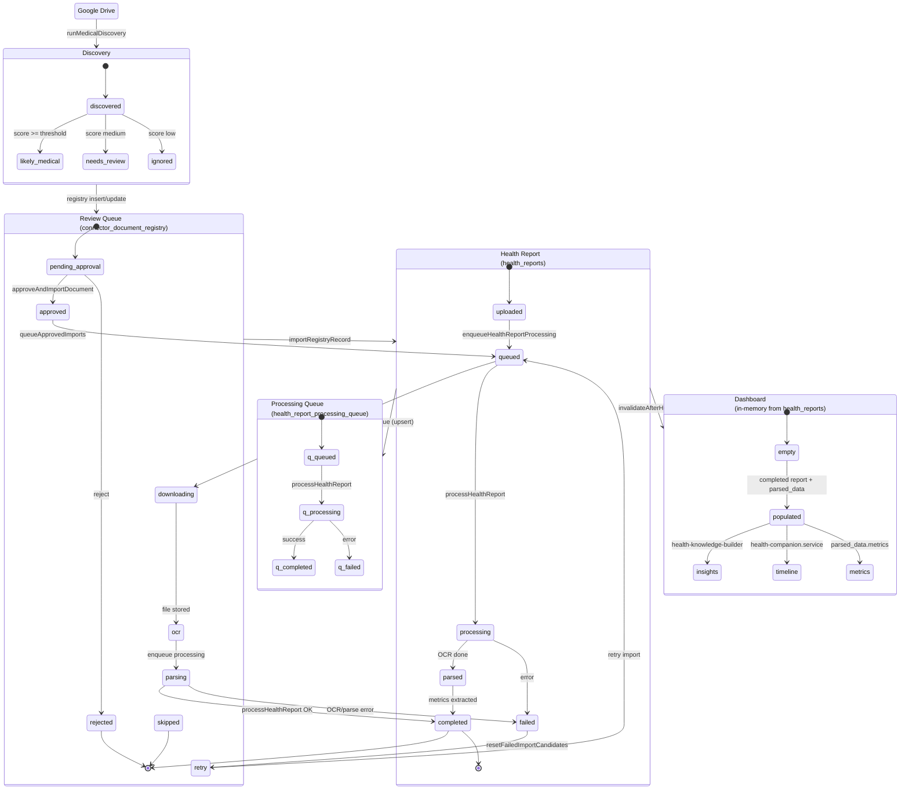

# Health Import Pipeline — State Machine Audit

**Date:** 2026-07-29  
**Scope:** Google Drive → Dashboard lifecycle  
**Status:** Root causes identified; backend fixes applied in this session.

---

## 1. Root Cause Analysis

### Issue 1: Approved reports still in "Waiting for Review"

| Root cause                     | Detail                                                                                                                                                                                                                                  |
| ------------------------------ | --------------------------------------------------------------------------------------------------------------------------------------------------------------------------------------------------------------------------------------- |
| **Semantic mismatch**          | `needsReviewCount` counted all `discovery_category = 'needs_review'` rows forever, ignoring `approval_status`. Approved items still incremented the badge.                                                                              |
| **Two-phase design (partial)** | Approve only set `connector_document_registry.approval_status = 'approved'`. Import was a separate manual step ("Import Approved"). UI showed approved-but-not-imported items in review queue by design (`isActionableReviewDocument`). |
| **Optimistic UI bug**          | `useImportReview` removed approved items optimistically, then refetch put them back in "Ready to import" — felt like approve did nothing.                                                                                               |

**Fix applied:** `needsReviewCount` now counts `approval_status === 'pending'` only. Approve triggers `approveAndImportDocument()` (approve + queue + OCR + metrics in one action).

### Issue 2: Approved reports never appear on Dashboard

| Root cause                     | Detail                                                                                                                                                                                 |
| ------------------------------ | -------------------------------------------------------------------------------------------------------------------------------------------------------------------------------------- |
| **Approval ≠ import**          | Dashboard reads `health_reports` with `status = 'completed'`. Approve alone never created/completed a health report.                                                                   |
| **Missing cache invalidation** | `ImportReviewPage.handleImportApproved` and `invalidateAfterImportReview` did not invalidate `health.reports` or dashboard queries. React Query served stale data for up to 2 minutes. |
| **Member filter**              | Reports with null/wrong `family_member_id` hidden for non-owner members (`filterReportsForMember`).                                                                                    |

**Fix applied:** Approve-and-import pipeline; `invalidateAfterHealthImport` on approve, import batch, and `processHealthReport` completion; `processImportQueueWithProgress` invalidates at end.

### Issue 3: Retry Import duplicate key

| Root cause                | Detail                                                                                                                                                                                                                                  |
| ------------------------- | --------------------------------------------------------------------------------------------------------------------------------------------------------------------------------------------------------------------------------------- |
| **INSERT without upsert** | `enqueueHealthReportProcessing()` always `INSERT` into `health_report_processing_queue`. On retry, `health_reports` row exists from first attempt but queue row also exists → `health_report_processing_queue_report_id_key` violation. |

**Fix applied:** Queue enqueue uses `upsert(..., { onConflict: 'report_id' })` resetting status to `queued`.

### Issue 4: Dashboard counts don't refresh

| Root cause                    | Detail                                                                                                    |
| ----------------------------- | --------------------------------------------------------------------------------------------------------- |
| **Partial invalidation**      | Approval path only invalidated review + import status, not reports/dashboard.                             |
| **In-memory knowledge cache** | Graph cache invalidated but React Query reports query was not — dashboard derived from stale report list. |
| **Sync useMemo graph**        | `useHealthKnowledge` recomputes only when `uploadedReports` prop changes (from reports query).            |

**Fix applied:** Unified invalidation on all pipeline exit points.

### Issue 5: Review Queue vs Dashboard different states

| Root cause                  | Detail                                                                                                                |
| --------------------------- | --------------------------------------------------------------------------------------------------------------------- |
| **Different data sources**  | Review queue = `connector_document_registry`. Dashboard = `health_reports.parsed_data` via in-memory knowledge graph. |
| **No shared state machine** | Registry `import_status` and report `status` updated in separate steps with no single orchestrator after approve.     |

**Fix applied:** Approve now runs full import orchestration; counts use pending approval semantics.

---

## 2. State Machine Diagram



---

## 3. Tables Involved

| Table                            | Role                                      | Key columns                                                                                      |
| -------------------------------- | ----------------------------------------- | ------------------------------------------------------------------------------------------------ |
| `connector_document_registry`    | Discovery + review + import tracking      | `discovery_category`, `approval_status`, `import_status`, `family_member_id`, `health_report_id` |
| `health_reports`                 | Canonical health report storage           | `status`, `parsed_data`, `family_member_id`, `external_file_id`                                  |
| `health_report_processing_queue` | OCR/metrics job queue (1:1 with report)   | `report_id` UNIQUE, `status`                                                                     |
| `health_folder_assignments`      | Drive folder → member mapping             | `folder_id`, `family_member_id`                                                                  |
| `connector_folders`              | Folder metadata                           | `external_folder_id`, `enabled`                                                                  |
| `health_discovery_runs`          | Scan audit                                | `medical_count`, `review_count`                                                                  |
| `health_knowledge_graphs`        | Persisted graph (write-only for UI today) | `member_id`, `graph_data`                                                                        |
| `connector_import_queue`         | Connector-level import jobs               | `registry_id`                                                                                    |

**Note:** There is no `health_metrics` or `health_summary` table. Metrics live in `health_reports.parsed_data`. Dashboard/timeline/insights are computed in-memory.

---

## 4. Services Involved

| Stage                | Service                            | Function                                            |
| -------------------- | ---------------------------------- | --------------------------------------------------- |
| Scan                 | `medical-discovery-engine.service` | `runMedicalDiscovery`                               |
| Score                | `medical-scoring.service`          | `scoreMedicalFile`                                  |
| Review list          | `import-review.service`            | `listReviewDocuments`, `isActionableReviewDocument` |
| Approve              | `import-review.service`            | `approveDocument`                                   |
| **Approve + import** | `import-pipeline.service`          | `approveAndImportDocument` _(new)_                  |
| Batch import         | `import-pipeline.service`          | `processApprovedImports`                            |
| Download + report    | `health-import-runner.service`     | `importRegistryRecord`                              |
| OCR + parse          | `health-processing.service`        | `processHealthReport`                               |
| Queue                | `health-processing.service`        | `enqueueHealthReportProcessing` _(upsert)_          |
| Journey              | `health-import-journey.service`    | `runHealthImportJourney`                            |
| Import status        | `health-import-status.service`     | `fetchHealthImportStatus`                           |
| Knowledge graph      | `health-knowledge-builder.ts`      | `buildHealthKnowledgeGraph`                         |
| Dashboard            | `health-companion.service`         | `buildHealthCompanionView`                          |
| Insights             | `health-insights.service`          | `getProactiveHealthInsights`                        |
| Cache                | `query-invalidation.ts`            | `invalidateAfterHealthImport`                       |

---

## 5. Broken Transitions (before fix)

| Transition                         | Expected                 | Actual (broken)                               |
| ---------------------------------- | ------------------------ | --------------------------------------------- |
| Approve → Health Report            | Create + complete report | Only `approval_status` updated                |
| Approve → Remove from review badge | Count drops              | Count used `discovery_category`, not approval |
| Retry → Processing queue           | Re-queue existing row    | Duplicate INSERT → unique violation           |
| Import complete → Dashboard        | Immediate refresh        | No React Query invalidation                   |
| Approve → Optimistic UI            | Show approved/importing  | Item removed then reappeared                  |

---

## 6. SQL / Schema Notes

No migration required for duplicate-key fix — application uses upsert on existing UNIQUE(`report_id`).

Optional hardening migration (not applied):

```sql
-- Ensure upsert-friendly index name (already exists as UNIQUE constraint)
-- No change needed unless adding partial index for active jobs
```

Orphan queue cleanup (manual/dev):

```sql
DELETE FROM health_report_processing_queue q
WHERE NOT EXISTS (SELECT 1 FROM health_reports r WHERE r.id = q.report_id);
```

---

## 7. Backend Fixes Applied

1. **`enqueueHealthReportProcessing`** — upsert on `report_id`, reset queue row to `queued`
2. **`approveAndImportDocument`** — single action: approve → queue → `importRegistryRecord`
3. **`processApprovedImports`** — invalidates health + dashboard queries on completion
4. **`processImportQueueWithProgress`** — invalidates at batch end
5. **`processHealthReport`** — calls `invalidateAfterHealthImport` on success
6. **`fetchHealthImportStatus`** — `needsReviewCount` = pending approval, not category count
7. **`processPendingHealthReports`** — enqueue `uploaded` reports before processing

---

## 8. Frontend Fixes Applied

1. **`useImportReview.approve`** — uses `approveAndImportDocument`, optimistic status update (not remove)
2. **`useImportReview.approveAllLikely`** — auto-runs `processApprovedImports` after batch approve
3. **`ImportReviewPage.handleImportApproved`** — calls `invalidateAfterHealthImport`
4. **`invalidateAfterImportReview`** — also invalidates reports + dashboard
5. **`ImportReviewPage`** — fixed empty-state copy

---

## 9. End-to-End Workflow (one approved report)

```
1. User assigns folder → health_folder_assignments
2. Scan → runMedicalDiscovery → registry rows (needs_review / likely_medical)
3. User opens /health/import/review → listReviewDocuments (pending items)
4. User clicks Approve on one document:
   a. approveDocument → approval_status = 'approved'
   b. import_status = 'queued'
   c. importRegistryRecord:
      - downloadDriveFile → storage
      - INSERT/UPDATE health_reports (status: uploaded, family_member_id set)
      - enqueueHealthReportProcessing (UPSERT queue)
      - processHealthReport → OCR → parsed_data → status: completed
      - registry import_status = 'completed'
   d. invalidateAfterHealthImport → React Query refetch
5. useHealthCompanion refetches health_reports
6. useHealthDashboard builds graph from completed report parsed_data
7. HealthOverviewPage shows dashboard (hasImportedReports = true)
8. needsReviewCount drops (approval_status no longer pending)
9. Review queue: item leaves actionable list (import_status = completed)
```

---

## 10. UI Subscriptions

| UI                       | Query / source                                      | Invalidated by                                               |
| ------------------------ | --------------------------------------------------- | ------------------------------------------------------------ |
| Import Review            | `['import-review', userId, 'actionable']`           | `invalidateAfterImportReview`, `invalidateAfterHealthImport` |
| Setup "Review N reports" | `['health-import-status', userId].needsReviewCount` | `invalidateImportStatusQueries`                              |
| Health Overview          | `['health-reports', userId]` → companion            | `invalidateAfterHealthImport`                                |
| Health Metrics/Insights  | Same reports → in-memory graph                      | Reports refetch triggers useMemo                             |
| Timeline                 | `companion.journeyEvents`                           | Reports refetch                                              |
| Reports list             | `['health-reports', userId]` + member filter        | `invalidateAfterHealthImport`                                |

---

## 11. Remaining Recommendations

1. **Auto-import on journey** — `runHealthImportJourney` auto-approves `likely_medical` but not `needs_review`; align with user expectation or document.
2. **Read persisted graph** — optionally hydrate dashboard from `health_knowledge_graphs` on cache miss.
3. **Unified pipeline orchestrator** — single service owning registry + report + queue state transitions.
4. **Events table** — optional `health_pipeline_events` for audit/debug instead of inferring from multiple tables.
5. **Discovery category update** — after successful import, could clear `needs_review` semantic confusion (category is immutable today).
