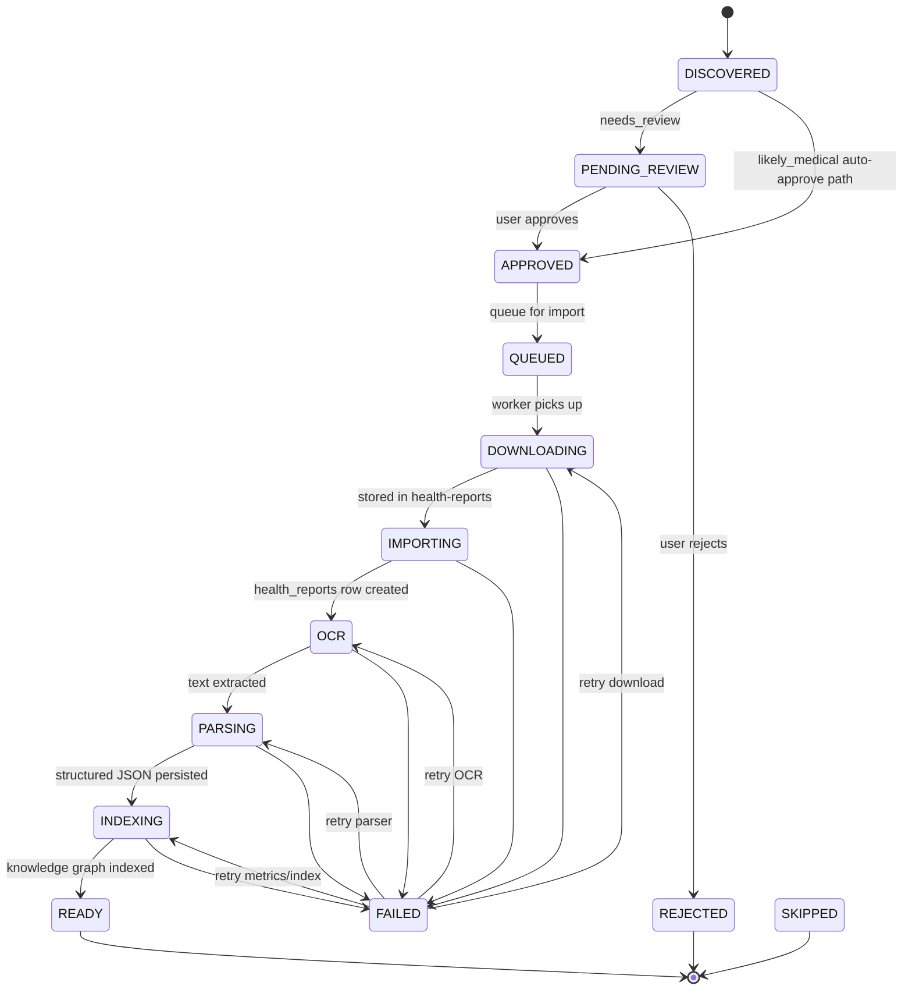

# Health Ingestion Pipeline — Production Architecture

## Mission

Process **N PDFs** from Google Drive through a deterministic workflow where each report has exactly one workflow instance and eventually reaches a terminal state: **READY**, **FAILED**, or **REJECTED**.

## State Transition Diagram

## Idempotency Strategy

| Layer            | Key                                                         | Behavior                                                      |
| ---------------- | ----------------------------------------------------------- | ------------------------------------------------------------- |
| Registry         | `(user_id, connector_id, external_file_id)`                 | Upsert on scan; preserve in-flight import status              |
| Workflow         | `registry_id` unique + `(user_id, external_file_id)` unique | `ensureWorkflowItemForRegistry` returns existing row          |
| Health report    | `(user_id, external_file_id)`                               | Update existing row on re-import; skip if completed unchanged |
| Processing queue | `report_id` unique                                          | Upsert, never duplicate queue rows                            |
| Knowledge graph  | `(user_id, family_member_id)`                               | Upsert graph JSON — idempotent rebuild                        |

**Scan safety:** Running scan multiple times updates metadata but does not create duplicate workflow items or re-import completed unchanged files.

## Retry Strategy

Failed stage is stored in `health_workflow_items.failed_stage`. Retry resumes at the correct stage:

| Failed at   | Retry resumes at | Action                                       |
| ----------- | ---------------- | -------------------------------------------- |
| DOWNLOADING | DOWNLOADING      | Re-invoke `drive-connector` download         |
| IMPORTING   | IMPORTING        | Re-create health report row                  |
| OCR         | OCR              | Re-run `processHealthReport` (OCR only path) |
| PARSING     | PARSING          | Re-run parser on existing OCR                |
| INDEXING    | INDEXING         | Re-run `persistHealthKnowledgeGraph`         |

Service: `retryFailedWorkflowItem()` in `health-workflow-retry.service.ts`

## Error Handling

Structured errors stored in `health_workflow_items.last_error_detail`:

- `stage`, `errorType`, `message`, `userMessage`
- `httpStatus`, `edgeFunction`, `stack`
- `recoveryRecommendation`, `requestPayload`, `responsePayload`

Users see `userMessage`; developers query workflow items/events for full detail.

## Database Changes

Migration: `20260737120000_health_workflow_production.sql`

New columns on `health_workflow_items`:

- `stage_started_at`, `stage_finished_at`
- `failed_stage`, `last_error_detail`, `progress`, `worker`

New states: `DOWNLOADING`, `OCR`, `PARSING`, `INDEXING`

Unique index: `(user_id, external_file_id)` — one workflow per Drive file

## Services Updated

| Service                               | Role                                       |
| ------------------------------------- | ------------------------------------------ |
| `health-workflow.service.ts`          | SSOT transitions, observability fields     |
| `health-workflow-retry.service.ts`    | Stage-specific retry                       |
| `health-workflow-projections.ts`      | Unified counts for all UI                  |
| `health-import-status.service.ts`     | Dashboard counts from workflow only        |
| `health-import-runner.service.ts`     | Batch import (parallel=3), download errors |
| `health-processing.service.ts`        | OCR → PARSING → INDEXING → READY           |
| `medical-discovery-engine.service.ts` | Idempotent scan + workflow ensure          |

## Batch Processing

- `processImportQueueWithProgress`: default **parallel=3**
- Each report: independent `Promise.allSettled` — one failure does not block others
- Supports 20–100 reports without architectural changes

## Dashboard Synchronization

All counts derive from `getHealthWorkflowProjection()`:

- `pendingReviewCount`, `importingCount`, `processingCount`
- `failedCount`, `readyCount`, `rejectedCount`

No independent registry-based count fallbacks in `fetchHealthImportStatus`.

## QA Validation Checklist

1. Load 20 mixed PDFs into assigned Drive folders
2. Scan once — verify 20 registry rows, 20 workflow items, no duplicates
3. Re-scan — verify counts unchanged for completed/unchanged files
4. Approve all — verify parallel import progresses independently
5. Confirm every item ends in READY, FAILED, or REJECTED
6. Verify Profile, Health Dashboard, Review show identical ready/failed/review counts
7. Retry one FAILED at OCR — verify only OCR re-runs, not download
