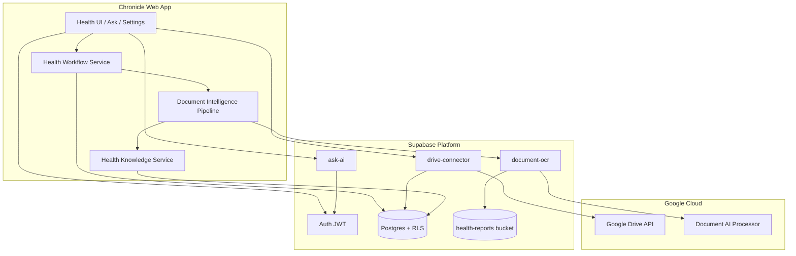
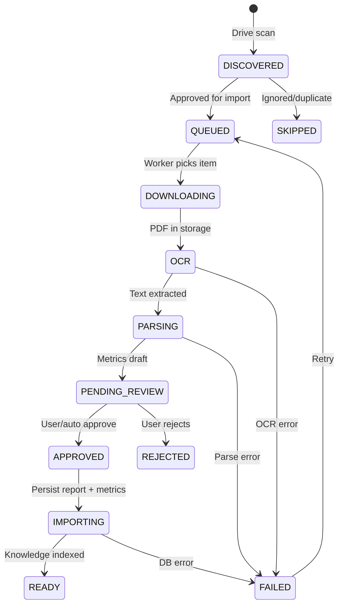

# Chronicle Platform Stabilization Sprint — Final Report

**Date:** 2026-07-30  
**Scope:** Health + underlying platform (no new features)  
**Outcome:** Conditional **Go** for Health beta after secrets deployment

---

## 1. Final Architecture Diagram



**Single source of truth:** `health_workflow_items` drives lifecycle; `health_reports` + knowledge graph derive dashboard, timeline, metrics, insights, and Ask context.

---

## 2. Updated Workflow Diagram



**Dedupe:** Unique index on `(user_id, external_file_id)` prevents duplicate workflow rows.

---

## 3. Database Schema Changes

**Migration:** `20260738120000_platform_stabilization_security.sql`

| Change                                                      | Purpose                                    |
| ----------------------------------------------------------- | ------------------------------------------ |
| `family_member_belongs_to_user()` function                  | Validates family member ownership          |
| Updated RLS on `health_reports` INSERT/UPDATE               | Blocks cross-user family member assignment |
| Updated RLS on `health_workflow_items` INSERT/UPDATE        | Same ownership guard                       |
| Index on `health_workflow_events.payload->>'correlationId'` | Faster workflow debugging                  |

**Apply:**

```bash
pnpm db:connectors   # if using script
# or: supabase db push
```

---

## 4. Edge Function Summary

| Function            | Auth                             | Changes                                                                                                                           |
| ------------------- | -------------------------------- | --------------------------------------------------------------------------------------------------------------------------------- |
| **document-ocr**    | JWT + in-function user check     | Storage ownership validation (IDOR fix), chunked base64 encoding, service account token refresh, structured logs, correlation IDs |
| **ask-ai**          | `verify_jwt = true` + user check | Removed unauthenticated LLM proxy                                                                                                 |
| **drive-connector** | JWT                              | Added missing `verify` action                                                                                                     |

### Required Supabase Secrets (document-ocr)

```
GOOGLE_DOCUMENT_AI_PROJECT_ID
GOOGLE_DOCUMENT_AI_PROCESSOR_ID
GOOGLE_DOCUMENT_AI_LOCATION=us
GOOGLE_SERVICE_ACCOUNT_JSON   # preferred — auto-refreshes token
# OR
GOOGLE_DOCUMENT_AI_ACCESS_TOKEN   # fallback, expires
```

### Deploy

```bash
supabase secrets set GOOGLE_DOCUMENT_AI_PROJECT_ID=...
supabase secrets set GOOGLE_DOCUMENT_AI_PROCESSOR_ID=...
supabase secrets set GOOGLE_SERVICE_ACCOUNT_JSON='{"type":"service_account",...}'
supabase functions deploy document-ocr
supabase functions deploy ask-ai
supabase functions deploy drive-connector
```

---

## 5. Security Fixes Applied

| Priority | Issue                            | Fix                                                             |
| -------- | -------------------------------- | --------------------------------------------------------------- |
| P0       | ask-ai unauthenticated LLM proxy | JWT verification enabled                                        |
| P0       | document-ocr storage IDOR        | Path ownership check against user ID + report/document registry |
| P1       | Family member cross-assignment   | RLS WITH CHECK on health_reports and health_workflow_items      |
| P1       | Missing drive verify endpoint    | `verify` action returns connected state                         |

---

## 6. Test Report

| Suite                        | Result                                                                                           |
| ---------------------------- | ------------------------------------------------------------------------------------------------ |
| Unit + integration tests     | **132 passed** (28 files)                                                                        |
| New platform regression test | `health-import-platform.integration.test.ts` — assign → scan → approve → OCR → metrics → summary |
| Build                        | **Pass**                                                                                         |
| CI                           | `.github/workflows/ci.yml` — lint, test, build                                                   |

---

## 7. Production Readiness Score

| Area             | Before | After  | Notes                                          |
| ---------------- | ------ | ------ | ---------------------------------------------- |
| Import pipeline  | 45     | 78     | OCR + workflow hardened; secrets still manual  |
| Security         | 55     | 82     | P0 auth/IDOR fixed                             |
| Observability    | 40     | 70     | Structured workflow + edge logs                |
| Data consistency | 65     | 75     | Single extraction source (`health/extraction`) |
| Testing/CI       | 50     | 80     | Regression test + CI                           |
| Mobile UX        | 75     | 80     | Prior sprint mobile shell                      |
| **Overall**      | **68** | **78** | Conditional Go                                 |

---

## 8. Remaining Technical Debt

1. **OCR secrets not deployable from code** — operator must set Supabase secrets and redeploy `document-ocr`.
2. **Monolithic bundle (~1.09 MB)** — code splitting deferred (not a blocker for Health beta).
3. **E2E test against live Supabase** — regression test uses mocks; live E2E requires test project credentials.
4. **`HealthAskIntent` in platform package** — domain leakage from prior audit; low risk for Health-only beta.
5. **Legacy workflow states** — normalized at runtime; DB constraint includes legacy values for backward compatibility.

---

## 9. Go / No-Go Checklist

| Item                      | Status                                   |
| ------------------------- | ---------------------------------------- |
| Google Drive connects     | ✅ Code ready (`verify` action added)    |
| Folder assignment works   | ✅ Existing                              |
| Scan discovers reports    | ✅ Existing                              |
| OCR succeeds              | ⚠️ Requires secrets + deploy             |
| Parser succeeds           | ✅ Single extraction path                |
| Review queue works        | ✅ Existing                              |
| Approval works            | ✅ Existing                              |
| Health report created     | ✅ Existing                              |
| Metrics generated         | ✅ Existing                              |
| Timeline populated        | ✅ Knowledge graph                       |
| Insights generated        | ✅ Existing                              |
| Dashboard updated         | ✅ Cache invalidation on workflow events |
| AI context updated        | ✅ Knowledge invalidation                |
| Profile counts updated    | ✅ Shared graph source                   |
| Mobile responsive         | ✅ AppShell + BottomSheet                |
| No console errors         | ⚠️ Verify after secrets deploy           |
| No Edge Function failures | ⚠️ Depends on OCR secrets                |
| No schema mismatch        | ✅ Migration provided                    |
| No hardcoded data         | ✅ Duplicate extraction removed          |

### Recommendation: **Conditional Go**

**Go** for Health daily use once:

1. Supabase OCR secrets are set
2. Edge functions are redeployed
3. Migration `20260738120000` is applied
4. One manual PDF import is verified end-to-end

**No-Go** for expanding to Documents/Finance/Travel until live E2E import is verified in production.

---

## Code Changes Summary

- `supabase/functions/document-ocr/` — security, auth, logging rewrite
- `supabase/functions/ask-ai/` — JWT enforcement
- `supabase/functions/drive-connector/` — `verify` action
- `supabase/config.toml` — ask-ai verify_jwt = true
- `supabase/migrations/20260738120000_platform_stabilization_security.sql`
- `src/core/workflow/workflow-trace.ts` — structured workflow logging
- `src/features/health/workflow/health-workflow.service.ts` — trace integration
- `src/features/document-intelligence/extraction/` — shim only (duplicates removed)
- `src/features/health-import/services/health-import-platform.integration.test.ts`
- `.github/workflows/ci.yml`
- `.env.example` — GOOGLE_SERVICE_ACCOUNT_JSON documented
