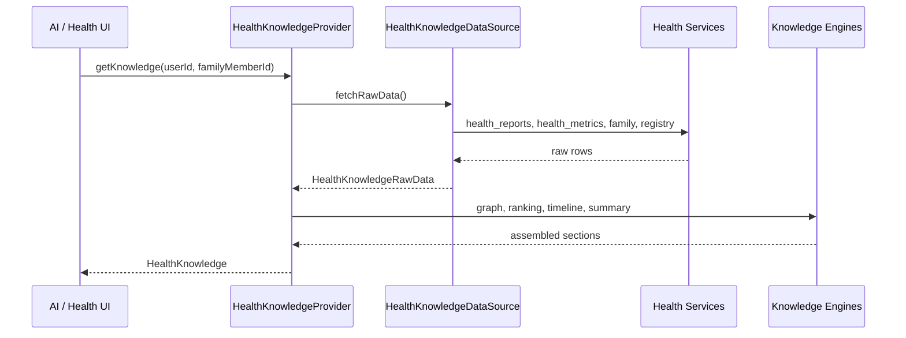

# Health Knowledge Layer

Production knowledge provider for the Health domain. Assembles all health information into a canonical `HealthKnowledge` object. This is the **only** interface AI and downstream consumers should use for structured health context.

## Architecture



## Canonical Object

`HealthKnowledge` (`types/health-knowledge-object.types.ts`) is independent of database shape:

| Field                                                                         | Purpose                                           |
| ----------------------------------------------------------------------------- | ------------------------------------------------- |
| `patient` / `familyMember`                                                    | Who the knowledge applies to                      |
| `latestReport` / `previousReports`                                            | Report references with readiness badges           |
| `metrics`                                                                     | All ranked metrics with confidence                |
| `abnormalMetrics` / `criticalMetrics` / `borderlineMetrics` / `normalMetrics` | Partitioned views                                 |
| `trendAnalysis`                                                               | Longitudinal metric trends with evidence          |
| `healthScore`                                                                 | Deterministic % normal (min 5 classified metrics) |
| `timeline`                                                                    | Structured events from metrics and reports        |
| `insights` / `recommendations`                                                | Graph-derived + coverage-aware guidance           |
| `confidence`                                                                  | Overall and component confidence scores           |
| `limitations`                                                                 | Structured codes (not UI strings)                 |
| `sources`                                                                     | Evidence source index                             |
| `summary`                                                                     | Deterministic summary for LLM context             |

## Public API

```typescript
import { healthKnowledgeProvider } from '@/features/health-knowledge'

const knowledge = await healthKnowledgeProvider.getKnowledge({
	userId: '...',
	familyMemberId: '...',
	accountOwnerMemberId: '...',
})
```

For tests and offline assembly:

```typescript
provider.buildFromRawData(rawData, input)
```

## Retrieval Flow

1. **Fetch** — `DefaultHealthKnowledgeDataSource` loads:
   - `health_reports` via `fetchUploadedHealthReports`
   - `health_metrics` via `fetchHealthMetricsForUser`
   - `family_members` via `listFamilyMembersWithAliases`
   - Import registry via `listRegistryRecords`

2. **Filter** — Member scoping via `filterReportsForMember`

3. **Graph** — `buildHealthKnowledgeGraph` merges stored metrics + parsed_data

4. **Coverage** — `buildHealthCoverageSnapshot` for corpus completeness

5. **Rank** — `evidence-ranking.engine` clinical priority

6. **Enrich** — timeline, limitations, insights, recommendations, summary

7. **Observe** — non-PHI build metrics logged

## Evidence Ranking

Priority (highest first):

1. **Critical** — status = critical
2. **Abnormal** — low / high
3. **Borderline**
4. **Important panel metrics** — heart, diabetes, liver, kidney, thyroid, blood + high-risk IDs
5. **Normal metrics**
6. **Qualitative / urine microscopy** — deprioritized (−60 score for routine urine)

Urine microscopy never dominates summaries.

## Confidence Model

Every metric exposes:

- `source`: `parser` | `llm` | `manual`
- `confidence`: 0–1
- `validationStatus`: `validated` | `partial` | `unvalidated` | `failed`
- `reportId` / `reportTitle`: report reference

Overall confidence combines data completeness, metric confidence, and parser confidence.

## Limitations

Structured `KnowledgeLimitationCode` values inside `HealthKnowledge.limitations`:

- `no_reports`, `single_report`, `no_previous_comparison`
- `missing_lipid_profile`, `missing_diabetes_panel`, `missing_thyroid_panel`
- `low_ocr_confidence`, `medium_parser_confidence`
- `import_failures`, `partial_report`, `reprocess_needed`, `processing_in_progress`, `incomplete_corpus`

## AI Platform Integration

`HealthKnowledgePlatformAdapter` (`shared/ai/knowledge/health-knowledge.provider.ts`) implements the platform `KnowledgeProvider` interface. When `userId` is present it delegates to `HealthKnowledgeProvider.getKnowledge()` and maps to `NormalizedKnowledge`.

## Future Modules

Documents, Finance, Travel, Mail, and Tasks should follow the same pattern:

1. Canonical knowledge object
2. Domain-owned provider with `getKnowledge()`
3. Platform adapter mapping to `NormalizedKnowledge`
4. No direct table access from AI layer
