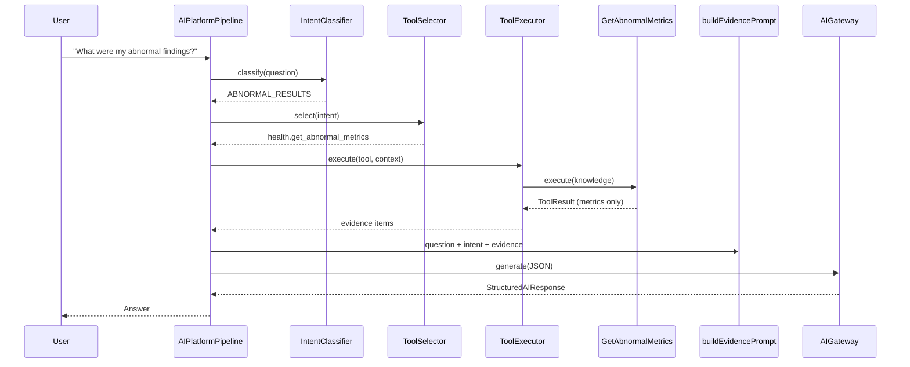
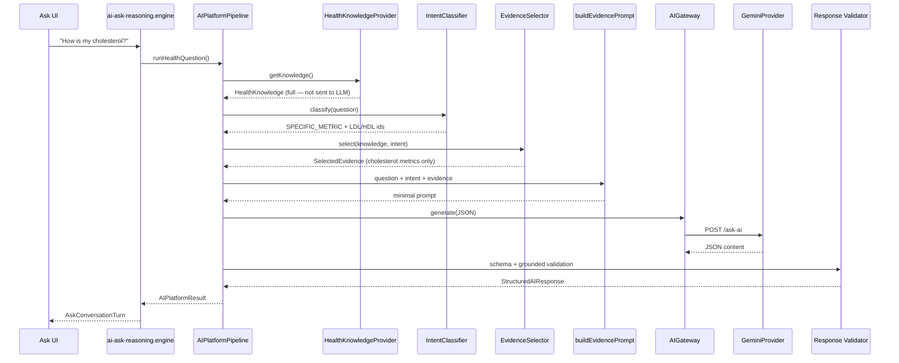

# Chronicle AI Platform v1

Chronicle AI Platform is the shared, provider-agnostic intelligence layer for the entire product. Health, Documents, Finance, Insurance, Travel, Mail, Tasks, and Family are **consumers** — they never call Gemini, OpenAI, or Claude directly.

## Design principles

1. **Single gateway** — all modules use `AIGateway`.
2. **Provider agnostic** — runtime selects provider via environment config only.
3. **Structured output only** — JSON schema validated on every response.
4. **Knowledge isolation** — AI layer never queries databases; callers supply payloads via `KnowledgeProvider` adapters.
5. **Minimum evidence** — every question is classified; tools retrieve only required data.
6. **Tool invocation** — retrieval happens through registered tools, never in prompts or by the LLM directly.
7. **Testability** — `MockProvider` enables full pipeline tests without external LLMs.

## Folder structure

```
src/shared/ai/
  config/           # Environment-driven platform config
  gateway/          # AIGateway — sole LLM entry point
  providers/        # Mock + Gemini/OpenAI/Claude providers
  prompt/           # Shared prompt templates and builder
  intent/           # Intent taxonomy + deterministic classifiers
  evidence/         # Evidence selection + token estimation
  intent-evidence/  # Orchestrator (classify → tool → evidence)
  tools/            # Tool registry, executor, permissions, health tools
  knowledge/        # KnowledgeProvider contract + Health adapter
  response/         # Zod schema + response validator
  observability/    # Request + evidence logging (no secrets)
  pipeline/         # End-to-end orchestration
  types/            # Platform types
  index.ts          # Public API
```

## Tool Invocation Framework

Chronicle AI Skills transform the platform from an answer engine into an action engine. Tools perform structured retrieval; the LLM never queries databases directly.

```
Question
  ↓
IntentClassifier
  ↓
ToolSelector (intent → tool mapping)
  ↓
ToolExecutor (permissions + timeout + observability)
  ↓
SelectedEvidence (from tool output)
  ↓
PromptBuilder
  ↓
AIGateway → Gemini
  ↓
Structured Response
```

### Tool contract

Every tool implements `ChronicleTool`:

| Field                          | Purpose                                        |
| ------------------------------ | ---------------------------------------------- |
| `name`                         | Unique id (e.g. `health.get_abnormal_metrics`) |
| `description`                  | What the tool retrieves                        |
| `inputSchema` / `outputSchema` | Structured I/O contract                        |
| `timeoutMs`                    | Execution timeout                              |
| `permissions`                  | Required caller role                           |
| `estimatedCostUsd`             | Cost hint for observability                    |
| `supportedIntents`             | Intents this tool serves                       |
| `execute(context, input)`      | Returns `ToolResult`                           |

### Health tools (v1)

| Tool                             | Intent(s)                         |
| -------------------------------- | --------------------------------- |
| `health.summarize_latest_report` | GENERAL_HEALTH_SUMMARY            |
| `health.get_latest_report`       | LATEST_REPORT, UNKNOWN            |
| `health.get_abnormal_metrics`    | ABNORMAL_RESULTS, RECOMMENDATIONS |
| `health.search_metrics`          | SPECIFIC_METRIC, NORMAL_RESULTS   |
| `health.get_metric_history`      | TREND_ANALYSIS, EXPLAIN_METRIC    |
| `health.compare_reports`         | COMPARE_REPORTS                   |
| `health.get_timeline`            | TREND_ANALYSIS                    |
| `health.get_health_score`        | GENERAL_HEALTH_SUMMARY            |
| `health.list_reports`            | COMPARE_REPORTS                   |

Tools read from `ToolContext.knowledge` (pre-loaded `HealthKnowledge`). No UI access. No database queries.

### Permissions

| Role            | Access                                |
| --------------- | ------------------------------------- |
| `read_only`     | Read tools for authorized member data |
| `family_member` | Own family member data                |
| `current_user`  | Selected member context               |
| `admin`         | Account owner — all family members    |

Validated in `ToolExecutor` before every execution.

### Tool observability

Each execution logs: `tool`, `executionTimeMs`, `inputSizeChars`, `outputSizeChars`, `success`, `failure`, `retryCount`, `confidence`.

### Extension strategy

```typescript
// Future: Documents module
registerDomainTool('documents', searchPassportTool)
registerDomainTool('documents', findInsuranceTool)

// Future: Finance module
registerDomainTool('finance', netWorthTool)
```

Register tools in `ToolRegistry`, map intents in domain-specific selectors, and reuse `ToolExecutor` unchanged.



## Intent Engine + Evidence Selection

Production AI never sends full `HealthKnowledge` to Gemini. Every request follows:

```
Question
  ↓
IntentClassifier (deterministic rules — no LLM)
  ↓
ToolSelector → ToolExecutor (retrieval via registered tools)
  ↓
KnowledgeGraphService.buildContext() (graph traversal)
  ↓
Evidence (graph + tool merge — minimum required subset)
  ↓
PromptBuilder (question + intent + evidence only)
  ↓
AIGateway → Gemini
  ↓
Structured Response + grounded validation
```

The AI Gateway does **not** know which module produced the evidence — only `SelectedEvidence` items with generic `type` labels (`health_metric`, `health_report`, etc.).

### Intent taxonomy (Health v1)

| Intent                   | Example question                          |
| ------------------------ | ----------------------------------------- |
| `GENERAL_HEALTH_SUMMARY` | How is my health overall?                 |
| `LATEST_REPORT`          | Summarize my latest report                |
| `ABNORMAL_RESULTS`       | Show abnormal results                     |
| `NORMAL_RESULTS`         | What's normal?                            |
| `SPECIFIC_METRIC`        | How is my cholesterol?                    |
| `TREND_ANALYSIS`         | Is my LDL improving?                      |
| `COMPARE_REPORTS`        | What changed since last year?             |
| `RECOMMENDATIONS`        | What should I do next?                    |
| `FOLLOW_UP_TESTS`        | What follow-up tests do I need?           |
| `EXPLAIN_METRIC`         | Explain my HbA1c                          |
| `UNKNOWN`                | Unrecognized question (grounded fallback) |

Classification lives in `health-intent-classifier.ts`. Future modules register parallel classifiers via `intent-registry.ts` (Document, Finance, Travel, Mail).

### Evidence selection examples

| Intent             | Selected evidence                       | Excluded                       |
| ------------------ | --------------------------------------- | ------------------------------ |
| `LATEST_REPORT`    | Latest report, its top metrics, summary | previousReports, full timeline |
| `SPECIFIC_METRIC`  | Matched metrics, trends, source report  | unrelated metrics              |
| `ABNORMAL_RESULTS` | Abnormal metrics, recommendations       | normal metrics                 |
| `COMPARE_REPORTS`  | Comparable reports, changed trends      | static snapshot only           |
| `UNKNOWN`          | Minimal summary + confidence            | full knowledge graph           |

### Token optimization

`HealthEvidenceSelector` records per request:

- `evidenceCount` — items sent to the LLM
- `estimatedTokens` — heuristic from selected payload size
- `excludedItems` — what was deliberately omitted
- `contextSizeChars` — serialized evidence size

Observability logs: `intent`, `selectedEvidence`, `excludedEvidence`, `estimatedTokens`, `provider`, `latency`.

### Prompt builder contract

`buildEvidencePrompt()` receives **only**:

- Question
- Classified intent
- Selected evidence

It never accesses `HealthKnowledge`, databases, or OCR.



## Core interfaces

### AIProvider

```typescript
interface AIProvider {
	readonly id: AIProviderId
	generate(request: AIGenerateRequest): Promise<AIGenerateResponse>
}
```

### IntentClassifier

```typescript
interface IntentClassifier {
	readonly domain: KnowledgeDomainId
	classify(question: string): ClassifiedIntent
}
```

### EvidenceSelector

```typescript
interface EvidenceSelector<TKnowledge> {
	readonly domain: KnowledgeDomainId
	select(input: {
		knowledge: TKnowledge
		intent: ChronicleIntent
		question: string
		metricIds?: string[]
		metricNames?: string[]
	}): SelectedEvidence
}
```

### KnowledgeProvider

Callers pass pre-loaded domain data. Providers normalize to `NormalizedKnowledge` without database access. Full knowledge is used **only** for evidence selection inside the pipeline — never serialized wholesale to the LLM.

## Response schema

```json
{
	"summary": "string",
	"overallStatus": "stable | needs_attention | critical | insufficient_data",
	"keyFindings": ["string"],
	"recommendations": ["string"],
	"followUpQuestions": ["string"],
	"confidence": 0.0,
	"limitations": ["string"],
	"evidenceReferences": [
		{ "id": "string", "label": "string", "sourceType": "string" }
	]
}
```

Validation retries on malformed JSON or grounded failures. Invalid output is never shown — Ask falls back to grounded summary.

## Configuration

| Variable            | Purpose                             | Default                        |
| ------------------- | ----------------------------------- | ------------------------------ |
| `VITE_AI_PROXY_URL` | Supabase `ask-ai` edge function URL | —                              |
| `VITE_AI_PROVIDER`  | `gemini` when proxy set             | `gemini` if proxy, else `mock` |
| `VITE_AI_MODEL`     | Gemini model id                     | `gemini-2.0-flash`             |
| `GEMINI_API_KEY`    | Server secret (edge function only)  | —                              |

## Extension strategy

### Adding a new domain (e.g. Finance)

1. Create `FinanceIntentClassifier implements IntentClassifier`.
2. Create `FinanceEvidenceSelector implements EvidenceSelector`.
3. Register both in `intent-registry.ts`.
4. Create `FinanceKnowledgeProvider implements KnowledgeProvider`.
5. Pipeline orchestrator resolves classifier/selector by `domain` — gateway unchanged.

### Adding a real LLM provider

1. Implement `generate()` in the target provider file.
2. Set `VITE_AI_PROVIDER` and `VITE_AI_MODEL` in environment.
3. All consumers automatically use the new provider via `AIGateway`.

## Observability

Every gateway request logs:

- `request_id`, `provider`, `model`
- `intent`, `classifiedIntent`
- `evidenceCount`, `excludedEvidence`, `estimatedContextTokens`
- `prompt_tokens`, `completion_tokens`, `latency_ms`
- `confidence`, `validationSuccess`

API keys and raw prompts are **never** logged.

## Testing

```bash
pnpm test src/shared/ai
```

All tests use `MockProvider` — no external network calls.

## Relationship to `@chronicle/core-ai`

`@chronicle/core-ai` remains the legacy Ask-specific layer. Chronicle AI Platform v1 (`src/shared/ai`) is the forward-looking abstraction. Modules should migrate to `@/shared/ai` over time.
