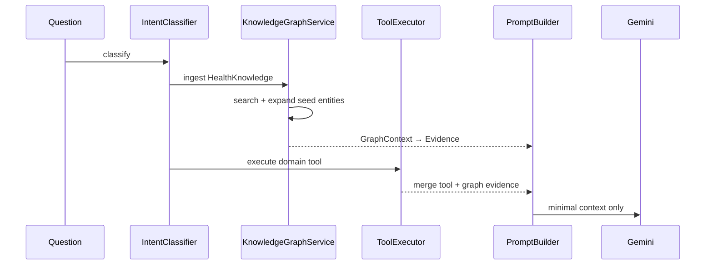

# Chronicle Knowledge Graph

The Knowledge Graph is Chronicle's central intelligence layer — a Personal Knowledge Operating System that connects every domain through explicit entities and relationships.

## Architecture

```
Domain Modules (Health, Documents, Finance, Travel, …)
  ↓ ingest via GraphDomainAdapter
KnowledgeGraphService
  ↓ entities + relationships
Graph Traversal (search, expand, trace, findRelated)
  ↓
buildContext() → GraphContext
  ↓
graphContextToEvidence() → SelectedEvidence → AI Platform → Gemini
```

The LLM never queries database tables. It receives only resolved graph context.

## Entity model

Canonical entity types (`ChronicleEntityType`):

| Domain       | Entities                                                                  |
| ------------ | ------------------------------------------------------------------------- |
| Core         | Person, FamilyMember                                                      |
| Health       | HealthReport, HealthMetric, HealthCategory, Recommendation, TimelineEvent |
| Documents    | Document, Passport                                                        |
| Finance      | BankAccount, Investment, Property, Vehicle                                |
| Travel       | Trip, Flight, Hotel, Visa                                                 |
| Productivity | Task, Email, CalendarEvent                                                |
| Insurance    | InsurancePolicy                                                           |

Every entity has: `id`, `type`, `label`, `domain`, `sourceProvider`, `metadata`.

## Relationship model

Explicit relationship types (`ChronicleRelationshipType`):

| Type           | Example                       |
| -------------- | ----------------------------- |
| `owns`         | Person → Passport             |
| `contains`     | HealthReport → HealthMetric   |
| `belongs_to`   | HealthMetric → HealthCategory |
| `required_for` | Passport → Trip               |
| `covered_by`   | Trip → InsurancePolicy        |
| `held_in`      | Investment → BankAccount      |
| `related_to`   | Task → Document               |
| `member_of`    | FamilyMember → Person         |

## Graph API

| Method                           | Purpose                                       |
| -------------------------------- | --------------------------------------------- |
| `findEntity(query)`              | Lookup by id, type, domain, label             |
| `findRelated(query)`             | Neighbors via relationship type + direction   |
| `search(query)`                  | Text search across entity labels and metadata |
| `expand(query)`                  | BFS traversal to depth N                      |
| `trace(query)`                   | Shortest path between two entities            |
| `buildContext(input)`            | Intent-aware subgraph for AI                  |
| `loadHealthKnowledge(knowledge)` | Ingest health domain via adapter              |

## Context generation flow



Example — **"What were my abnormal findings?"**:

```
ABNORMAL_RESULTS intent
  → seed: HealthMetric entities (abnormal)
  → expand: HealthReport (contains), HealthCategory (belongs_to), Recommendation (related_to)
  → tool: health.get_abnormal_metrics
  → merged evidence → Gemini
```

Example — **"What documents do I need for my Japan trip?"** (future):

```
Trip:Japan
  → expand: Visa, Passport, Travel Insurance, Flights, Hotels, Tasks
  → only linked entities sent to LLM
```

## Health adapter

`healthGraphAdapter` projects `HealthKnowledge` into:

- Person, FamilyMember
- HealthReport, HealthMetric, HealthCategory
- Recommendation, TimelineEvent
- Relationships: `contains`, `belongs_to`, `member_of`, `related_to`

Future modules register parallel adapters without changing the graph service.

## Observability

Every graph operation logs:

- `entityCount`, `relationshipCount`
- `traversalTimeMs`, `contextBuildTimeMs`
- `linkedEntities`, `operation`

## Extension strategy

```typescript
// 1. Define adapter
const travelGraphAdapter: GraphDomainAdapter<TripBundle> = {
	domain: 'travel',
	ingest(store, trips) {
		/* Trip, Visa, Passport, Flight entities */
	},
}

// 2. Register
defaultKnowledgeGraphService.registerAdapter(travelGraphAdapter)

// 3. Ingest on AI request
service.ingestDomain('travel', tripData)

// 4. buildContext traverses cross-domain links automatically
```

No changes to AI Gateway, ToolExecutor, or Intent Engine required.

## Folder structure

```
src/shared/knowledge-graph/
  types/           entity, relationship, graph context types
  store/           in-memory GraphStore with indexes
  services/        KnowledgeGraphService, traversal, context builder
  adapters/        domain ingest adapters (health first)
  observability/   graph operation logging
  __tests__/       entity, traversal, context, circular ref tests
  index.ts
  ARCHITECTURE.md
```

## Testing

```bash
pnpm test src/shared/knowledge-graph
```

Tests cover: entity creation, relationships, traversal, context generation, missing links, circular references.
